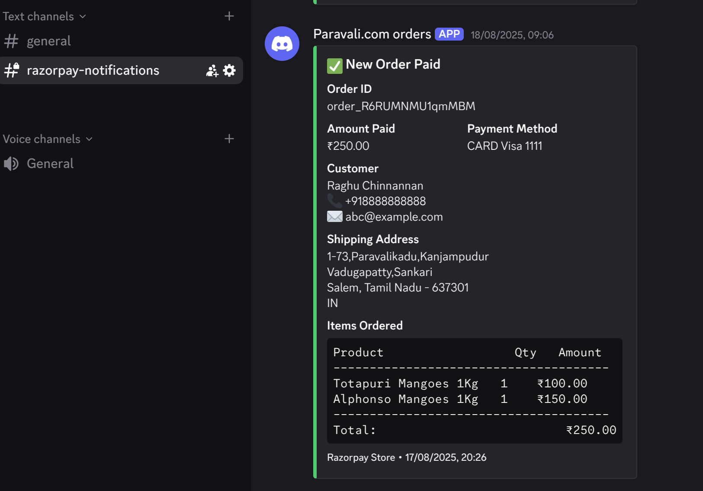

# Razorpay → Discord Order Notifier (Cloudflare Worker)

Receive **Razorpay Webhook events** and send clean, formatted **order notifications** to a Discord channel.

When a customer pays for an order in your Razorpay Web Store, this Worker:
- Receives the `order.paid` webhook payload
- Maps `line_item` IDs to actual product names
- Formats items into a **table-like order receipt**
- Sends a pretty **Discord embed message** with customer + order details

---

## 🚀 Example Discord Notification




---

## ⚡ Deploy to Cloudflare

Click below to deploy instantly on your Cloudflare account:

[](https://deploy.workers.cloudflare.com/?url=https://github.com/raghuchinnannan/razorpay-discord-notifier)

---

## 🛠️ Setup

### 1. Clone Repository

```bash
git clone https://github.com/raghuchinnannan/razorpay-discord-notifier.git
cd razorpay-discord-notifier
```

### 2. Install Wrangler
Wrangler is Cloudflare’s CLI tool.
```bash
npm install -g wrangler
```
### 3. Configure Secrets

You’ll need your Discord Webhook URL:
```bash
wrangler secret put DISCORD_WEBHOOK_URL
```
Paste your Discord webhook URL when prompted.

### 4. Deploy Worker
```bash
wrangler deploy
```
Wrangler will give you a Worker URL like:

`https://razorpay-discord-notifier.YOUR_SUBDOMAIN.workers.dev`
---
## 🔗 Connect to Razorpay

1. Go to your Razorpay Dashboard → Settings → Webhooks.
2. Add a new webhook pointing to your Worker URL (from step 4).
3. Select `order.paid` event.
4. Save.

Now every successful order will trigger a Discord notification 🎉.
---
## 🔧 Configuration
### Product Mapping

Inside `index.js` or `worker.js`, update the `PRODUCT_MAP` object:
```js
const PRODUCT_MAP = {
  "li_Q91XHLltyscRla": "Totapuri Mangoes 1Kg",
  "li_Q91XHMPO9SbK7i": "Alphonso Mangoes 1Kg",
   // Replace with your product details
   // Add more mappings as needed
};
```


